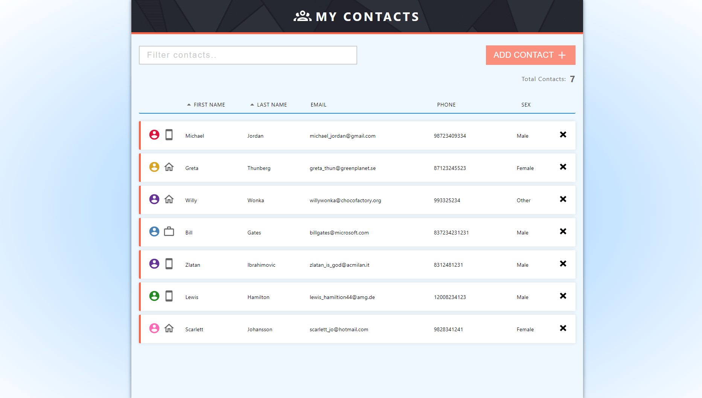
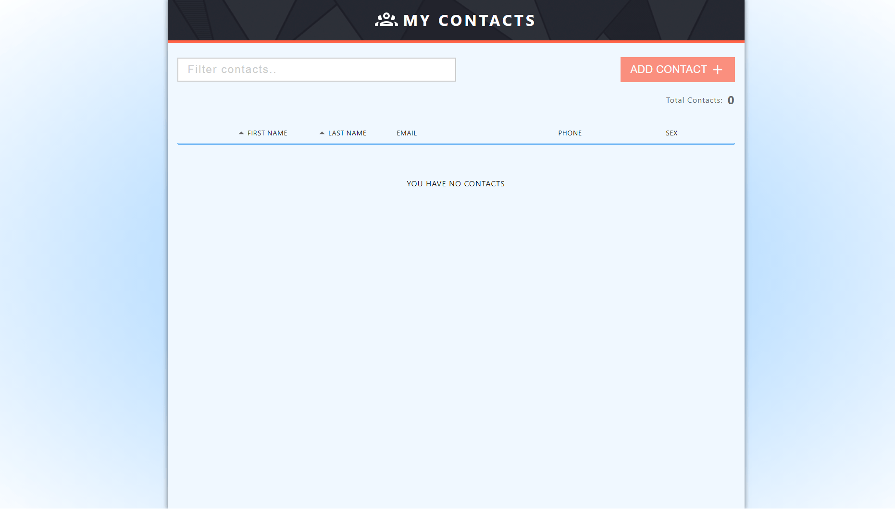

# Contacts App

This is a personal **React** project focused on form handling and controlled inputs.

This app is fully responsive.

---

Technologies used:

1. HTML 
2. CSS
3. JAVASCRIPT
4. REACT
5. USESTATE & USEEFFECT HOOKS
6. HIGH ORDER FUNCTIONS (MAP, SORT & FILTER)
7. LOCAL STORAGE
8. CHANGE & CLICK EVENTS

[View Project](https://my-contacts-appp.herokuapp.com/)

---

In the project directory, you can run:

### `npm start`

---

---

---

[View Project](https://my-contacts-appp.herokuapp.com/)

